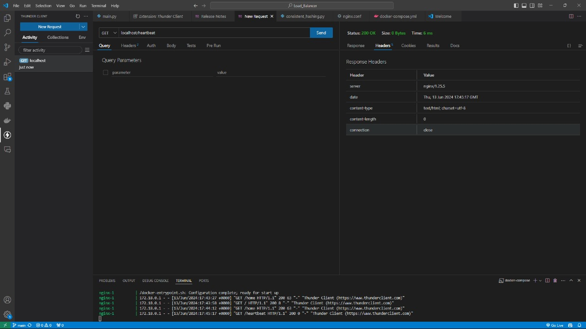
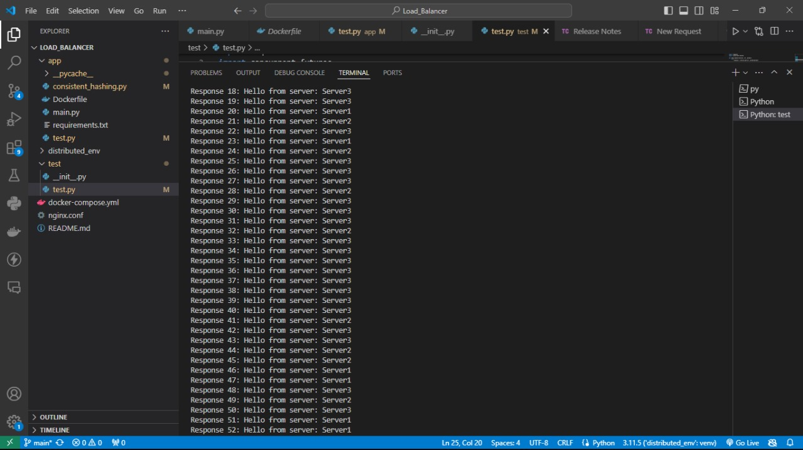
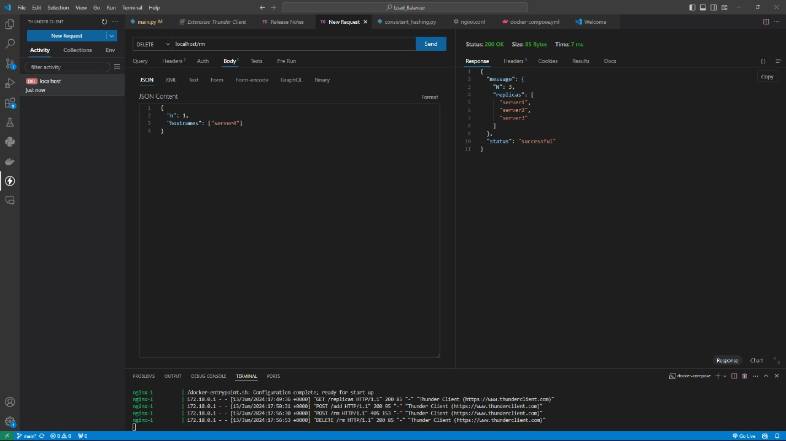

# Load Balancing Project

This README file provides an overview and documentation for the Load Balancing project by Group 8. The project is designed to distribute incoming requests across multiple servers, ensuring efficient resource utilization and improved system performance.

## Project Structure

The project structure is as follows:

```
Load_Balancer/
├── app/
│   ├── __pycache__/
│   ├── consistent_hashing.py
│   ├── Dockerfile
│   └── main.py
├── requirements.txt
├── test/
│   ├── __init__.py
│   └── test.py
├── .gitignore
├── docker-compose.yml
├── nginx.conf
└── README.md
```

## Project Setup

1. Clone the repository:
   ```
   git clone https://github.com/your-username/load-balancing-project.git
   ```

2. Navigate to the project directory:
   ```
   cd load-balancing-project
   ```

3. Build and run the Docker containers:
   ```
   docker-compose up --build
   ```

## Usage

### Testing the Load Balancer

1. Open a new terminal window and run the Thunder Client (or any other API testing tool).

2. Send a `GET` request to `localhost:8000/heartbeat` to check if the load balancer is running.

   
  

   The response should show a successful status code (200 OK) and an empty response body.

3. To test the load balancing functionality, send a `POST` request to `localhost:8000/add` with the following JSON body:

   ```json
   {
     "a": 3,
     "hostname": ["server1"]
   }
   ```

   

   The response should include a JSON object containing the input values and a list of available servers.

4. To test the load balancing across multiple requests, you can run the `test.py` script, which sends multiple requests to the load balancer and displays the responses from different servers.

   

   You should see the responses coming from different servers (`server1`, `server2`, `server3`), demonstrating the load balancing functionality.

5. To remove the servers from the load balancer, send a `DELETE` request to `localhost:8000/rm` with the following JSON body:

   ```json
   {
     "a": 3,
     "hostname": ["server4"]
   }
   ```

   

   The response should include a JSON object confirming the successful removal of the specified servers.

## Testing

This project includes a suite of test cases to ensure the proper functioning of the load balancer. The tests are located in the `test/test.py` file.

To run the tests, navigate to the project directory and execute the following command:

```
python -m unittest discover test
```

This command will discover and run all the test cases in the `test` directory.

## Deployment Instructions

This project is designed to be deployed using Docker containers. The `docker-compose.yml` file includes the necessary configurations for running the load balancer application and its dependencies.

To deploy the project, follow these steps:

1. Ensure you have Docker and Docker Compose installed on your system.

2. Navigate to the project directory:
   ```
   cd load-balancing-project
   ```

3. Build and run the Docker containers:
   ```
   docker-compose up --build
   ```

This command will build the Docker images and start the containers for the load balancer application and any required dependencies.

